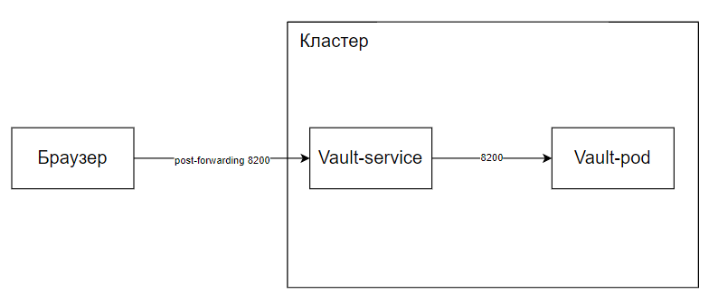

University: [ITMO University](https://itmo.ru/ru/)  
Faculty: [FICT](https://fict.itmo.ru)  
Course: [Introduction to distributed technologies](https://github.com/itmo-ict-faculty/introduction-to-distributed-technologies)  
Year: 2022/2023  
Group: K4113c  
Author: Zhukov Georgii Konstantinovich
Lab: Lab1  
Date of create: 01.12.2022  
Date of finished: 01.12.2022  

# Ход работы
1) Установка  

Сперва мы скачали minikube с официального сайта, установили и запустили.
 

2) Манифест

Далее мы создали манифест для пода и применили его в kubernetes. 
```yaml
apiVersion: v1
kind: Pod
metadata:
  name: vault-pod
  labels:
    app: vault-pod
spec:
  containers:
    - name: vault
      image: vault:latest
      ports:
        - containerPort: 8200
```
Также командой мы проверили, что под был создан.  


3) Сервис и запуск

Теперь мы создадим сервис.    
  

Получим доступ к Vault.    
  

На данный момент имеет текущую картину.  
  

4) Нахождение токена

Чтобы найти токен откроем второй терминал и там введем команду для логов. (minikube kubectl -- logs service/vault-pod)   
  

Введем появившийся токен.    
  

Как мы видим, мы смогли успешно зайти. Лабораторная работа выполнена.  

5) Схема  

  
